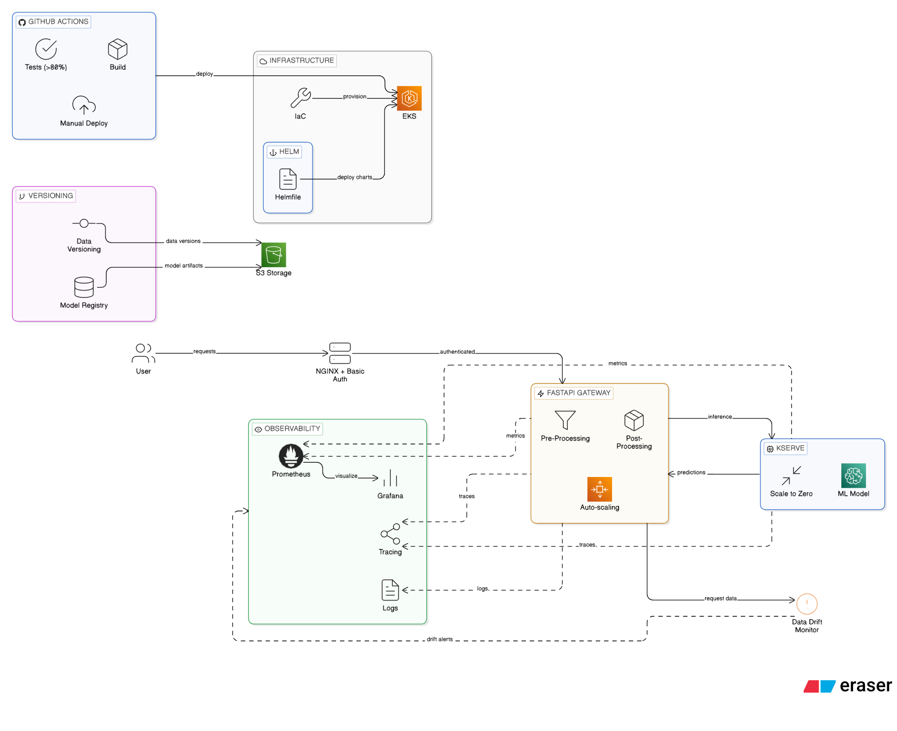

# ML-Ops: Review Sentiment Analysis

A MLOps stack for sentiment analysis using BERT, built on Kubernetes.

## Table of Contents

1. [Overview](#ml-ops-review-sentiment-analysis)
2. [High Level Architecture](#high-level-architecture)
3. [Project Structure](#project-structure)
4. [Stack](#stack)
5. [Prerequisites](#prerequisites)

6. [Infrastructure — Provision EKS](#1-infrastructure--provision-eks)
7. [Install Cluster Components](#2-install-cluster-components)
8. [Kubernetes Secrets](#3-kubernetes-secrets)
9. [Data — Pull with DVC](#4-data--pull-with-dvc)
10. [Model — Train and Log to MLflow](#5-model--train-and-log-to-mlflow)

11. [CI/CD — GitHub Actions](#6-cicd--github-actions)
12. [Deploy Model](#7-deploy-model)
13. [Testing](#8-testing)
14. [Accessing Services](#9-accessing-services)
15. [Send a Prediction](#10-send-a-prediction)
16. [Destroy Infrastructure](#11-destroy-infrastructure)

## High level architecture

```

```

## Project Structure

```
ml-ops/
├── .github/workflows/    # CI/CD pipeline
├── data/                 # DVC-tracked data
├── helm/                 # Helm charts
│   ├── evidently/
│   ├── fastapi-gateway/
│   ├── kserve-model/
│   └── mlflow/
├── infra/eks/            # Terraform (EKS)
├── k8s/                  # Raw Kubernetes manifests
├── requirements/         # Python dependencies
├── scripts/              # Utility scripts (pull_model.py)
├── src/
│   ├── app/              # FastAPI gateway + KServe predictor
│   ├── evidently/        # Drift detection service
│   ├── common/           # Shared utilities
│   ├── train.py          # Model training
│   └── eval.py           # Model evaluation
├── tests/                # Unit + integration tests
└── helmfile.yaml         # Helmfile for all charts
```

## Stack

| Component | Technology |
|---|---|
| Model Serving | KServe + Knative (scale-to-zero) |
| Pre/Post Processing | FastAPI + HPA |
| API Gateway | NGINX Ingress + Basic Auth |
| Metrics | Prometheus + Grafana |
| Tracing | Jaeger (OpenTelemetry) |
| Logging | Loki + Promtail |
| Data Drift | Evidently |
| Model Versioning | MLflow |
| Data Versioning | DVC |
| Infrastructure | Terraform (EKS) |
| CI/CD | GitHub Actions |
| Packaging | Helm + Helmfile |

---

## Guide to install and run code:

---

## Prerequisites

- AWS account with IAM user (not root) with `AdministratorAccess`
- AWS CLI configured: `aws configure --profile eks-admin`
- Docker
- kubectl
- Helm
- Helmfile
- Terraform
- Python 3.10+
- DVC with S3 remote

---

## 1. Infrastructure — Provision EKS

```bash
cd infra/eks
terraform init
terraform apply
```

Update kubeconfig:
```bash
aws eks update-kubeconfig --name eks-ap-southeast-1 --region ap-southeast-1 --profile eks-admin
kubectl get nodes
```

---

## 2. Install Cluster Components

Install KServe and Knative manually (not via Helm):
```bash
# cert-manager
kubectl apply -f https://github.com/cert-manager/cert-manager/releases/latest/download/cert-manager.yaml

# KServe
kubectl apply -f https://github.com/kserve/kserve/releases/latest/download/kserve.yaml

# Knative
kubectl apply -f https://github.com/knative/serving/releases/latest/download/serving-crds.yaml
kubectl apply -f https://github.com/knative/serving/releases/latest/download/serving-core.yaml
```

Install everything else with Helmfile:
```bash
helmfile sync
```

---

## 3. Kubernetes Secrets

Create S3 credentials secret:
```bash
kubectl create secret generic s3-credentials \
  --from-literal=AWS_ACCESS_KEY_ID=<your-key> \
  --from-literal=AWS_SECRET_ACCESS_KEY=<your-secret>

# Copy to mlflow namespace
kubectl get secret s3-credentials -n default -o yaml | \
  sed 's/namespace: default/namespace: mlflow/' | \
  kubectl apply -f -
```

Create basic auth secret for NGINX:
```bash
sudo apt install apache2-utils
htpasswd -c auth admin
kubectl create secret generic basic-auth --from-file=auth
```

Create service account:
```bash
kubectl apply -f k8s/serviceaccount.yaml
```

---

## 4. Data — Pull with DVC

```bash
pip install -r requirements/requirements.ml.txt
dvc pull
```

---

## 5. Model — Train and Log to MLflow

Port-forward MLflow:
```bash
kubectl port-forward svc/mlflow 5000:5000 -n mlflow
```

Train and log model:
```bash
export MLFLOW_TRACKING_URI=http://localhost:5000
python src/train.py
```

Model will be logged to MLflow and artifacts stored in S3.

---

## 6. CI/CD — GitHub Actions

### Secrets required in GitHub repository:

| Secret | Description |
|---|---|
| `AWS_ACCESS_KEY_ID` | AWS access key |
| `AWS_SECRET_ACCESS_KEY` | AWS secret key |
| `DOCKERHUB_USERNAME` | DockerHub username |
| `DOCKERHUB_TOKEN` | DockerHub access token |
| `MLFLOW_TRACKING_URI` | MLflow server URL (EKS) |

### Pipeline behavior:

- **Push to main** → runs tests (Pytest, coverage >80%) → auto-triggers build (pull model from MLflow, build and push Docker images)
- **Manual trigger** (`workflow_dispatch`) → runs test → build → deploy to EKS via Helm

---

## 7. Deploy Model

```bash
kubectl apply -f k8s/transformer.yaml
```

Or via Helm:
```bash
helm install kserve-model helm/kserve-model
```

---

## 8. Testing

### Unit tests:
```bash
pip install pytest pytest-cov
pytest tests/test_gateway.py --cov=gateway --cov-fail-under=80
```

### Integration tests (requires port-forward):
```bash
kubectl port-forward svc/ingress-nginx-controller 8080:80 -n ingress-nginx
pytest tests/test_integration.py -v
```

---

## 9. Accessing Services

| Service | Command | URL |
|---|---|---|
| Grafana | `kubectl port-forward svc/prometheus-grafana 3000:80 -n monitoring` | http://localhost:3000 |
| Jaeger | `kubectl port-forward svc/jaeger-query 16686:16686 -n monitoring` | http://localhost:16686 |
| MLflow | `kubectl port-forward svc/mlflow 5000:5000 -n mlflow` | http://localhost:5000 |
| Evidently | `kubectl port-forward svc/evidently 8001:8001` | http://localhost:8001 |
| Gateway | `kubectl port-forward svc/ingress-nginx-controller 8080:80 -n ingress-nginx` | http://localhost:8080 |

### Grafana credentials:
```bash
kubectl --namespace monitoring get secrets prometheus-grafana \
  -o jsonpath="{.data.admin-password}" | base64 -d
```

---

## 10. Send a Prediction

```bash
curl -u admin:<password> \
  -H "Host: gateway.local" \
  -X POST http://localhost:8080/predict \
  -H "Content-Type: application/json" \
  -d '{"text": "this movie was great"}'
```

Response:
```json
{"label": "Positive", "confidence": 0.98}
```

---

## 11. Destroy Infrastructure

```bash
cd infra/eks
terraform destroy
```

---
